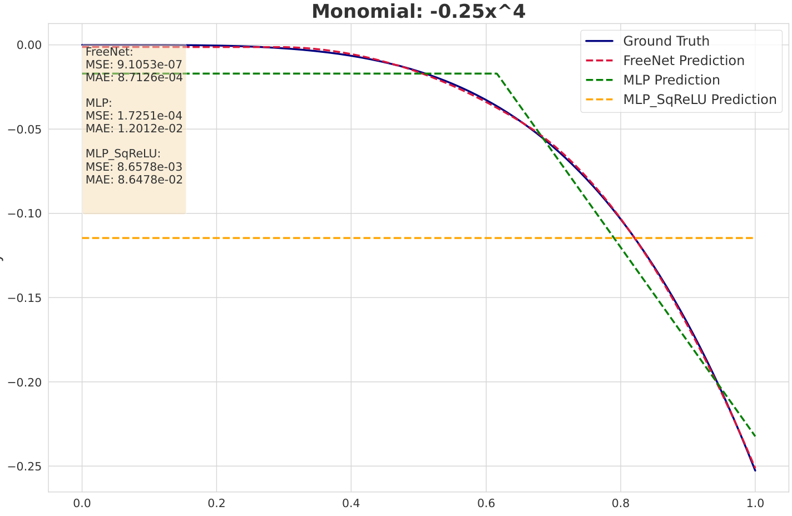
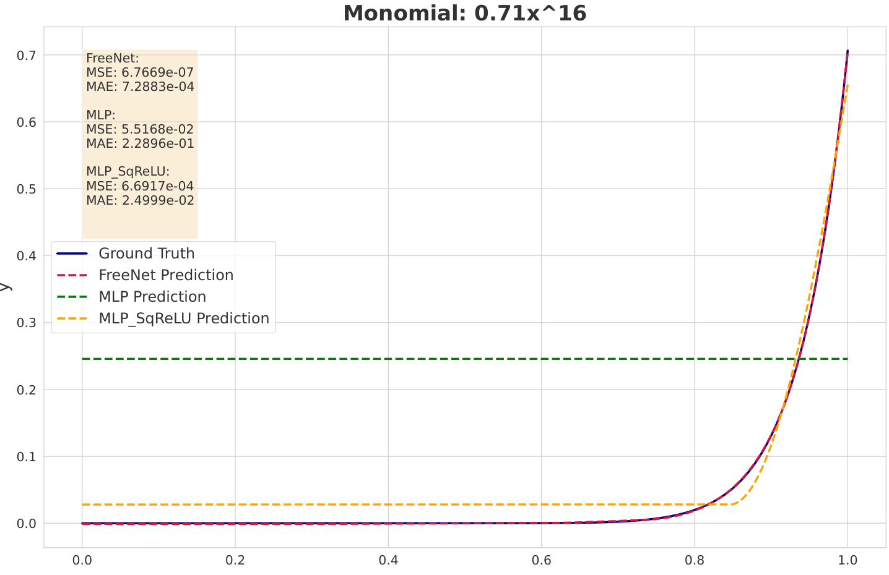
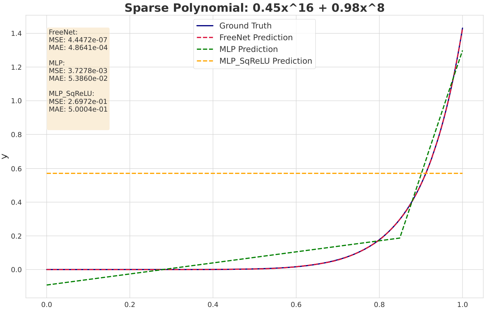
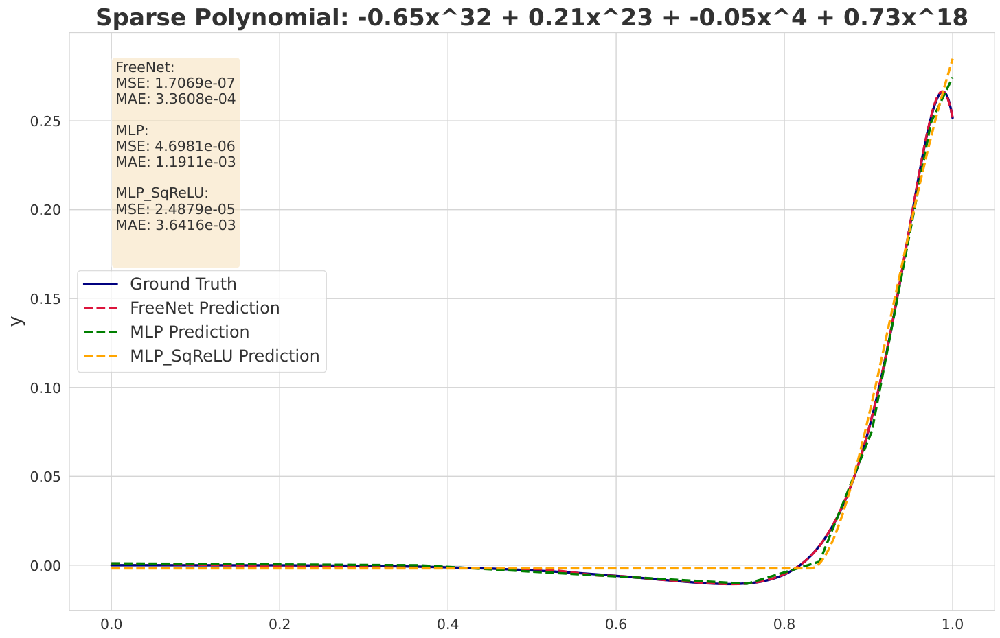
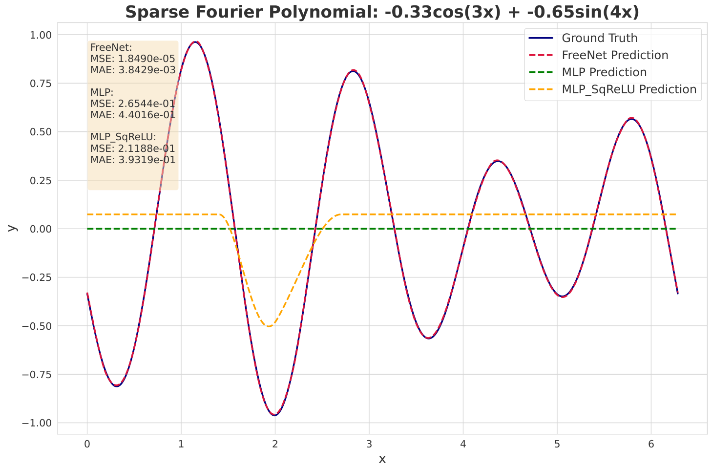
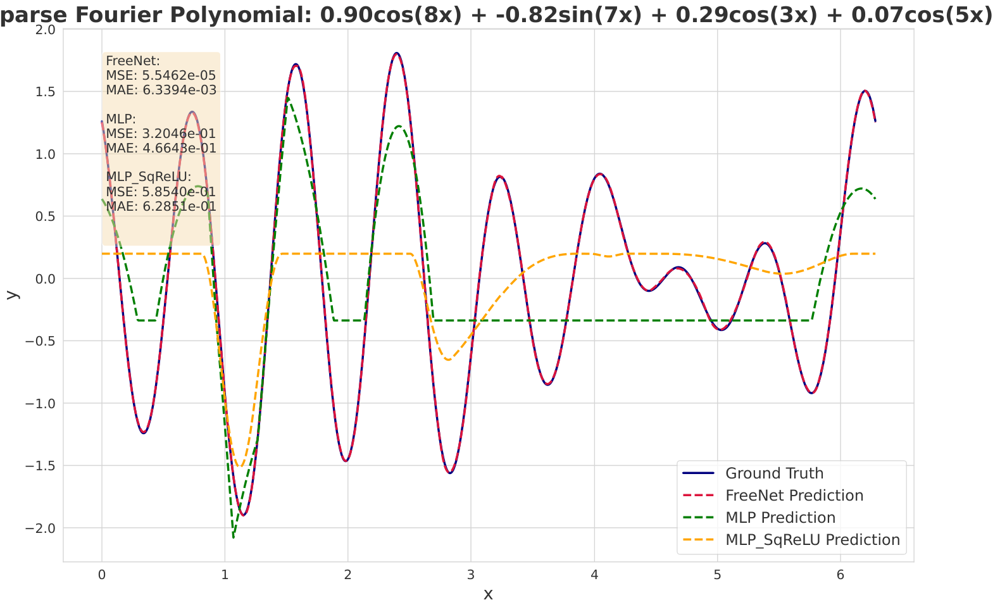
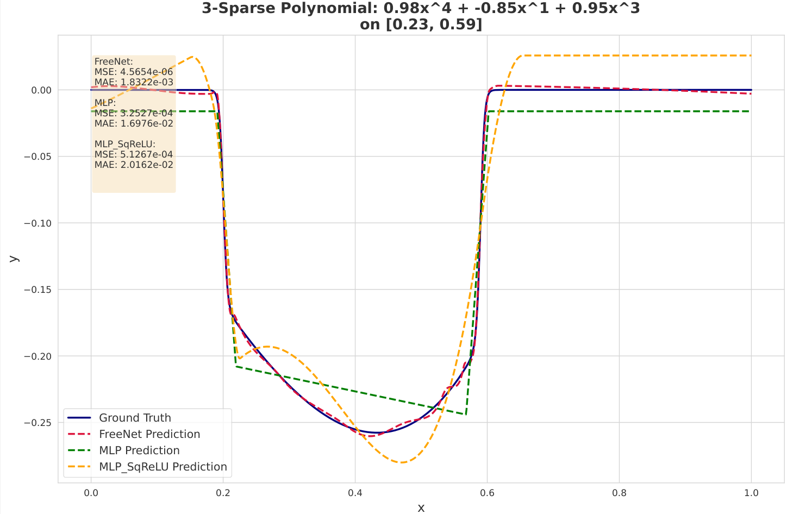
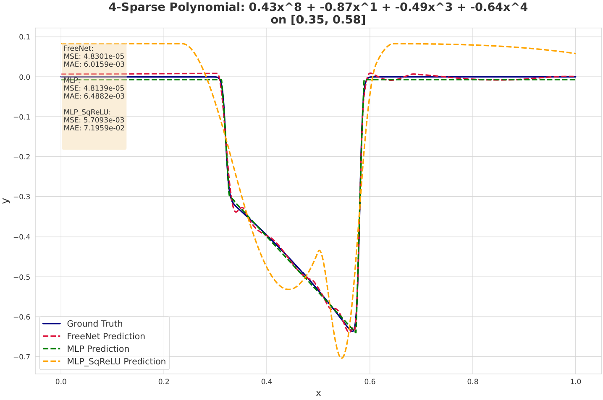

# Freenets Function Approximation Experiments

This repository contains a collection of experiments that explore the ability of different neural network architectures to approximate various mathematical functions, including monomials, sparse polynomials, trigonometric polynomials, and interval-defined polynomials.

## Table of Contents

- [Introduction](#introduction)
- [Project Structure](#project-structure)
- [Dependencies](#dependencies)
- [Getting Started](#getting-started)
- [Experiments](#experiments)
  - [Monomials](#monomials)
  - [Sparse Polynomials](#sparse-polynomials)
  - [Trigonometric Polynomials](#trigonometric-polynomials)
  - [Interval Sparse Polynomials](#interval-sparse-polynomials)
- [Results](#results)
- [Acknowledgments](#acknowledgments)

## Introduction

The primary goal of these experiments is to investigate how different neural network architectures perform in approximating various mathematical functions. Specifically, we compare the performance of:

- **FreeNet**: A custom neural network architecture designed for function approximation.
- **MLP**: A standard Multi-Layer Perceptron with ReLU activation functions.
- **MLP_SqReLU**: An MLP with squared ReLU activation functions.

We generate datasets based on different types of functions and train the neural networks to learn these functions from data. The experiments aim to evaluate the models' ability to generalize and accurately approximate the target functions.

## Results

In this section, we evaluate the expressive power and efficiency of the proposed Free Network (FreeNet) architecture. We compare FreeNet against traditional Multi-Layer Perceptrons (MLPs) and MLPs with squared ReLU activations (MLP SqReLU) in representing monomials, sparse polynomials, and trigonometric polynomials of varying degrees and sparsity levels. Our goal is to demonstrate the advantages of FreeNet in representing these function classes using significantly fewer neurons, thereby validating the theoretical results presented earlier.

### Experimental Setup

We conducted experiments on synthetic datasets representing the following target functions:

- **Monomials**: \( f(x) = a x^N \), where \( a \in [-1, 1] \) and \( x \in [0, 1] \).
- **Sparse Polynomials**: \( f(x) = \sum_{i=1}^{k} a_i x^{N_i} \), where \( a_i \in [-1, 1] \), \( N_i \in \{1, \dots, N\} \), and \( x \in [0, 1] \).
- **Trigonometric Polynomials**: \( f(x) = \sum_{i=1}^{k} \left( \text{flag}_i \, a_i \sin(m_i x) + (1 - \text{flag}_i) \, a_i \cos(m_i x) \right) \), where \( \text{flag}_i \in \{0, 1\} \), \( m_i \in [1, N] \), \( a_i \in [-1, 1] \), and \( x \in [0, 1] \).

We compared three models:
1. **FreeNet**: Our proposed architecture with dense connectivity and specialized activation functions.
2. **MLP**: A standard feedforward neural network with ReLU activations, using the same number of neurons as FreeNet, distributed over two hidden layers.
3. **MLP SqReLU**: An MLP using squared ReLU activations with the same setup.

The models were trained using $L_\infty$ loss, optimized with the Adam optimizer. Performance was evaluated using mean squared error (MSE) and results were averaged over five runs.

### Monomial Representation

We assessed each model's ability to represent monomials of varying degrees. FreeNet consistently outperformed both MLP and MLP SqReLU across all degrees tested. Table 1 presents the MSE for different degrees and neuron counts.

### Table 1: MSE for Monomial Representation

| Degree (\(d\)) | Neurons (\(h\)) | FreeNet (MSE) | MLP (MSE) | MLP SqReLU (MSE) |
|----------------|-----------------|---------------|-----------|------------------|
| 2              | 2               | 2.79e-5       | 1.25e-2   | 2.03e-2          |
| 4              | 2               | 1.06e-4       | 1.72e-2   | 2.28e-2          |
| 4              | 4               | 5.82e-7       | 2.53e-2   | 1.30e-2          |
| 8              | 4               | 4.47e-6       | 2.57e-2   | 1.30e-2          |
| 12             | 4               | 1.10e-5       | 2.33e-2   | 1.15e-2          |
| 16             | 4               | 2.02e-5       | 3.44e-2   | 1.00e-2          |
| 8              | 8               | 9.45e-7       | 1.00e-3   | 2.12e-4          |
| 16             | 8               | 1.26e-5       | 5.80e-4   | 1.95e-4          |
| 24             | 8               | 4.96e-6       | 1.08e-3   | 2.69e-4          |
| 32             | 8               | 3.45e-4       | 6.72e-3   | 1.82e-4          |

### Sparse Polynomial Representation

We evaluated sparse polynomials with varying degrees \( N \) and sparsity levels \( k \). FreeNet consistently achieved lower MSE compared to MLP and MLP SqReLU. Table 2 summarizes the performance across different degrees and sparsity levels.

### Table 2: MSE for Sparse Polynomial Representation

| Degree (\(d\)) | Sparsity (\(k\)) | Neurons (\(h\)) | FreeNet (MSE) | MLP (MSE) | MLP SqReLU (MSE) |
|----------------|------------------|-----------------|---------------|-----------|------------------|
| 4              | 2                | 2               | 9.98e-4       | 5.38e-2   | 5.54e-2          |
| 4              | 3                | 4               | 1.04e-3       | 6.27e-2   | 1.10e-1          |
| 4              | 4                | 6               | 9.59e-8       | 1.07e-1   | 9.00e-2          |
| 8              | 2                | 6               | 1.39e-6       | 4.03e-2   | 1.21e-3          |
| 8              | 3                | 8               | 3.48e-6       | 4.09e-2   | 1.10e-1          |
| 8              | 4                | 12              | 8.76e-7       | 1.45e-4   | 5.57e-5          |
| 16             | 2                | 8               | 1.87e-5       | 1.12e-3   | 5.36e-2          |
| 16             | 3                | 12              | 8.44e-7       | 1.68e-3   | 3.16e-5          |
| 16             | 4                | 16              | 2.66e-6       | 2.97e-4   | 8.65e-5          |
| 32             | 2                | 10              | 6.44e-6       | 2.37e-4   | 1.28e-3          |
| 32             | 3                | 16              | 7.65e-6       | 8.47e-3   | 2.18e-2          |
| 32             | 4                | 20              | 8.36e-6       | 7.63e-5   | 8.65e-5          |

### Trigonometric Polynomial Representation

For trigonometric polynomials, FreeNet again demonstrated superior performance across different frequencies \( N \) and number of terms \( k \). Table 3 presents the MSE for the trigonometric polynomial experiments.

### Table 3: MSE for Trigonometric Polynomial Representation

| Degree (\(d\)) | Terms (\(k\))    | Neurons (\(h\)) | FreeNet (MSE) | MLP (MSE) | MLP SqReLU (MSE) |
|----------------|------------------|-----------------|---------------|-----------|------------------|
| 4              | 2                | 8               | 3.70e-2       | 2.67e-1   | 2.98e-1          |
| 4              | 3                | 8               | 1.16e-1       | 3.60e-1   | 3.17e-1          |
| 4              | 4                | 8               | 8.48e-6       | 4.66e-1   | 2.74e-3          |
| 8              | 2                | 24              | 1.07e-1       | 1.74e-1   | 3.57e-1          |
| 8              | 4                | 24              | 4.52e-5       | 1.13e-1   | 2.40e-1          |
| 8              | 8                | 24              | 1.07e-4       | 4.17e-3   | 3.34e-2          |

### Key Takeaways

Our experiments confirm that FreeNet provides a more expressive and efficient architecture for representing monomials, sparse polynomials, and trigonometric polynomials compared to traditional MLPs. FreeNet consistently achieves lower MSE, demonstrating higher accuracy with fewer parameters, which validates our theoretical analysis.

## Function Plots

Next, we showcase some plots demonstrating the power of FreeNet for function representation. Each plot compares the predictions of different models (FreeNet, MLP, and MLP SqReLU) against the true target functions, providing a visual insight into how well FreeNet approximates the target function.

### Monomials

Below are plots comparing the model predictions with the true monomials of various degrees \( N \) using \( n \) hidden neurons. These plots highlight how FreeNet accurately approximates high-degree monomials even with a logarithmic number of neurons relative to the degree \( N \). 

#### Degree 4 Monomial (Left) | Degree 16 Monomial (Right)

 

- **Left**: Degree 4 monomial with 2 hidden nodes approximation by FreeNet and baselines. FreeNet closely matches the true function with fewer neurons.
- **Right**: Degree 16 monomial represented with 4 hidden nodes shows FreeNet maintaining accuracy even as the degree increases, with significantly fewer neurons than MLP.

### Sparse Polynomials

Next, we study the representation of sparse polynomials with varying degrees \( N \) and sparsity levels \( k \). The following plots compare the model predictions with the true sparse polynomials. Each configuration uses a specific number of hidden neurons \( n \) in FreeNet and the baseline MLP architectures for comparison.

#### Degree 16, Sparsity 2 Polynomial (Left) | Degree 32, Sparsity 4 Polynomial (Right)

 

- **Left**: FreeNet’s performance on a sparse polynomial with degree 16 and sparsity 2 with 8 hidden neurons. The model accurately approximates the polynomial with fewer neurons.
- **Right**: Degree 32 and sparsity 4 polynomial with 20 hidden neurons, where FreeNet demonstrates efficiency in learning higher-degree sparse polynomials compared to the baselines.

### Trigonometric Polynomials

For trigonometric polynomials, FreeNet continues to outperform traditional MLPs in learning representations. The following plots demonstrate the model's ability to approximate sine and cosine functions in the polynomial.

#### Frequency 4, Terms 2 Polynomial (Left) | Frequency 8, Terms 4 Polynomial (Right)

 

- **Left**: Trigonometric polynomial with frequency 4 and 2 terms with 8 hidden neurons. FreeNet accurately tracks both sine and cosine components with fewer neurons.
- **Right**: Trigonometric polynomial with frequency 8 and 4 terms with 24 hidden neurons. FreeNet outperforms MLP in both accuracy and efficiency, requiring fewer neurons to approximate complex functions.


### Polynomials Between Intervals

In this section, we investigate polynomials defined over specific intervals. FreeNet excels at representing such functions, providing smooth transitions at the interval boundaries while maintaining accuracy. The following plots compare the predictions of FreeNet, MLP, and MLP SqReLU against the ground truth for interval-based sparse polynomials. 

#### Degree 4, Sparsity 3, Neurons 12 (Left) | Degree 8, Sparsity 4, Neurons 10 (Right)

 

- **Left**: For a degree 4 polynomial with sparsity 3 and neurons 12, FreeNet achieves a very low MSE of **4.57e-06**, significantly outperforming both MLP (MSE: **3.25e-04**) and MLP SqReLU (MSE: **5.13e-04**). The interval polynomial is defined as \( 0.98x^4 - 0.85x^1 + 0.95x^3 \) on \( [0.23, 0.59] \), where FreeNet closely follows the true function.
  
- **Right**: For a more complex degree 8 polynomial with sparsity 4 and neurons 10, FreeNet achieves an MSE of **4.83e-05**, closely matching MLP's performance (MSE: **4.81e-05**) while far outperforming MLP SqReLU (MSE: **5.71e-03**). The polynomial is \( 0.43x^8 - 0.87x^1 - 0.49x^3 - 0.64x^4 \) on \( [0.35, 0.58] \). FreeNet shows superior efficiency in capturing the behavior of the polynomial within the interval.

In both cases, FreeNet demonstrates the ability to approximate interval-based polynomials with a higher degree of accuracy and fewer neurons, particularly in comparison to traditional MLP models.

## Project Structure

The repository is organized as follows:

- `experiments/`: Contains the main scripts to run the experiments.
  - `monomials.py`
  - `sparse_polynomials.py`
  - `trig_polynomials.py`
  - `interval_polynomials.py`
- `models/`: Contains the implementations of the neural network architectures.
  - `freenet.py`
  - `mlp.py`
  - `mlp_sqrelu.py`
- `data_generators/`: Scripts for generating datasets.
  - `monomials.py`
  - `sparse_polynomials.py`
  - `trig_polynomials.py`
  - `interval_sparse_polynomials.py`
- `utilities/`: Utility functions for data handling, training, testing, and plotting.
  - `data_utilities.py`
  - `general_utilities.py`
  - `NumpyEncoder.py`
- `trainers/`: Training scripts for neural networks.
  - `train_nn.py`
- `testers/`: Testing and evaluation scripts.
  - `test_nn.py`
- `optimizers/`: Optimizer configurations.
  - `optimizer_params.py`
- `plotters/`: Scripts for generating plots of results.
  - `monomial_plotter.py`
  - `sparse_polynomial_plotter.py`
  - `trig_polynomial_plotter.py`
  - `interval_sparse_polynomial_plotter.py`
- `figures/`: Directory where generated plots are saved.
- `outputs/`: Directory where experiment results are saved as JSON files.

## Dependencies

The code is written in Python and relies on the following libraries:

- Python 3.7+
- NumPy
- PyTorch
- Matplotlib

To install the required dependencies, run:

```bash
pip install -r requirements.txt
```

**Note**: Ensure that you have a compatible version of PyTorch installed. You can install PyTorch by following the instructions on the [official website](https://pytorch.org/get-started/locally/).

## Getting Started

1. **Clone the repository**:

   ```bash
   git clone https://github.com/yourusername/your-repo-name.git
   cd your-repo-name
   ```

2. **Set up a virtual environment (optional but recommended)**:

   ```bash
   python -m venv venv
   source venv/bin/activate  # On Windows, use 'venv\Scripts\activate'
   ```

3. **Install dependencies**:

   ```bash
   pip install -r requirements.txt
   ```

## Experiments

Each experiment can be run independently from the base directory. Navigate to the base directory (the root of the repository) and execute the desired experiment script using Python.

### Monomials

**Script**: `experiments/monomials.py`

**Description**: Trains neural networks to approximate monomial functions of the form \( y = c x^d \).

**Usage**:

```bash
python experiments/monomials.py
```

**Configurations**:

The script runs experiments over various configurations defined in the `configurations` list within the `main()` function.

### Sparse Polynomials

**Script**: `experiments/sparse_polynomials.py`

**Description**: Trains neural networks to approximate sparse polynomials, i.e., polynomials with a small number of non-zero coefficients.

**Usage**:

```bash
python experiments/sparse_polynomials.py
```

### Trigonometric Polynomials

**Script**: `experiments/trig_polynomials.py`

**Description**: Trains neural networks to approximate trigonometric polynomials composed of sine and cosine functions.

**Usage**:

```bash
python experiments/trig_polynomials.py
```

### Interval Sparse Polynomials

**Script**: `experiments/interval_polynomials.py`

**Description**: Trains neural networks to approximate polynomials defined over specific intervals using smooth transitions (e.g., sigmoid functions) at the boundaries.

**Usage**:

```bash
python experiments/interval_polynomials.py
```

## Results

- **Outputs**: The experiment results are saved in the `outputs/` directory as JSON files with timestamps.
- **Figures**: Plots of the true functions versus the neural network approximations are saved in the `figures/` directory, organized by experiment.
